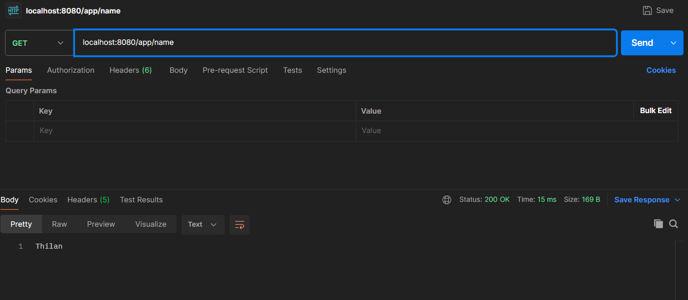
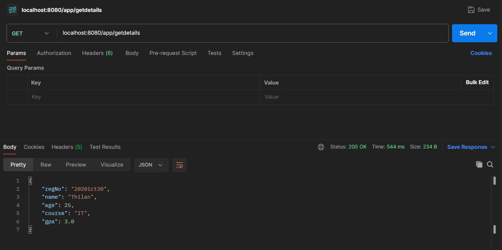
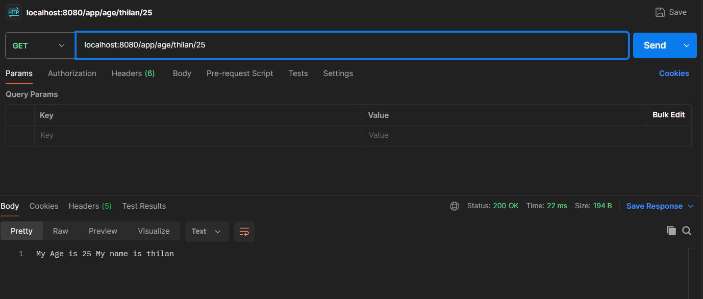
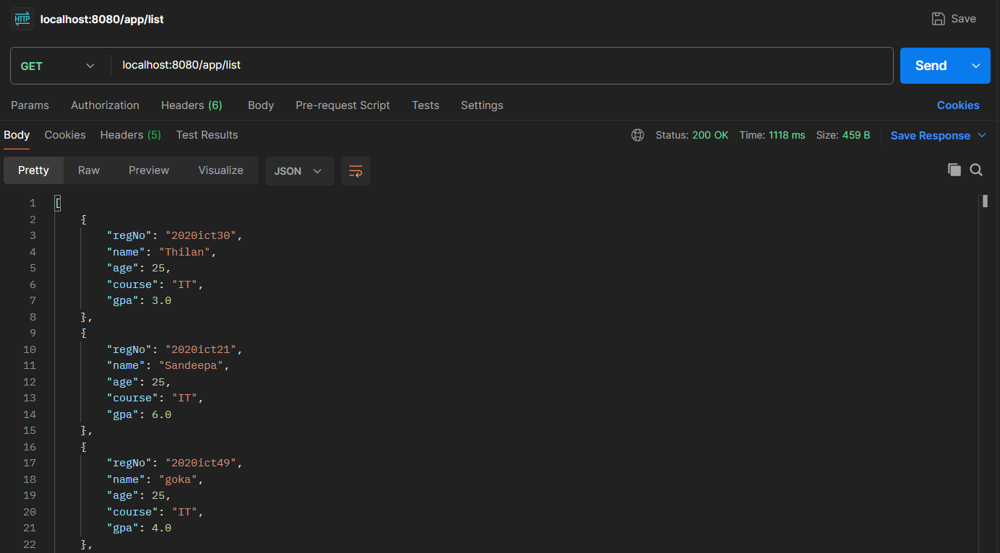
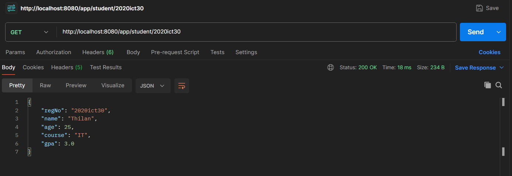

<h1>2020/ICT/30</h1>
<H2>Day 02 Practicals</H2>

In this practical we are learned how to pass multiple parameters using pathvariable and how to create object and display object items

<h2>Outputs</h2>

